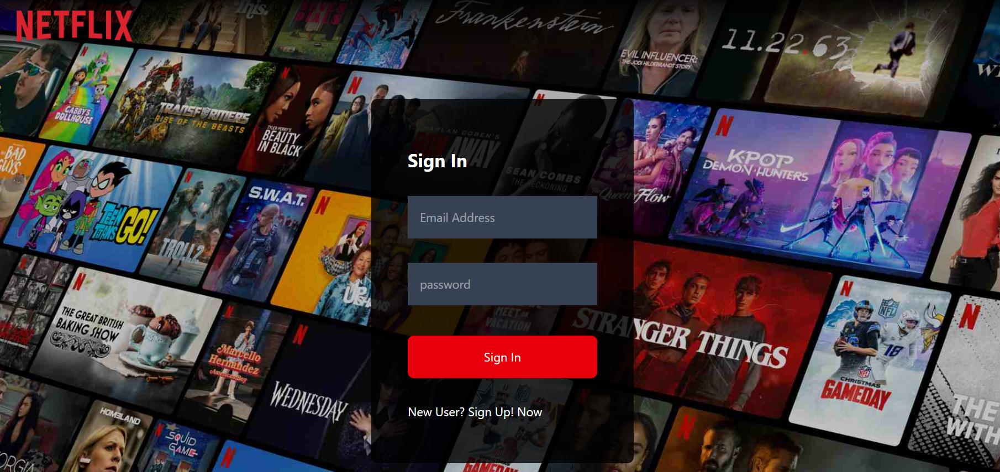

Netflix-GPT 🎬🤖

AI-Powered Movie Recommendation Web App
A responsive web app that suggests movies using AI and fetches detailed info from TMDB API. Supports multi-language interface and user authentication via Firebase.

🚀 Features

Generate personalized movie recommendations using AI prompts.

Fetch movie details dynamically from The Movie Database (TMDB) API.

Fully responsive UI with Tailwind CSS and smooth UX.

Redux Toolkit for global state management.

Firebase Authentication for secure user login/sign-up.

Multi-language support with dynamic content based on user preference.

Secure Node.js backend to handle AI requests without exposing API keys.

Instant search and curated recommendations for users.

🛠 Tech Stack

Frontend: React, Redux, Js(ES6), Tailwind CSS

Backend: Node Js, Express, Firebase

APIs: Groq API, TMDB API

📸 Screenshots:

Login / Firebase Auth:

Browse/ Home page:

Movie Details:

Movie Recommendations using Groq API:

Home / Multi-Language Interface:

🔧 Installation & Setup

Clone the repository:

git clone https://github.com/allemkarthik/NetFlix_Gpt_react.git

Frontend setup:

cd NetFlix_Gpt_react:
npm install:
npm run build:

Backend setup:

cd backend:
npm install:
cp .env.example .env:
# Add your GROQ_API_KEY and Firebase keys in .env
npm start

Update GptSearchBar.jsx API URL to your deployed backend URL.

Configure Firebase .env keys if not already set.

🌐 Live Demo: https://allemkarthik.github.io/NetFlix_Gpt_react/#/ 

Netflix-GPT on GitHub Pages

✨ Future Enhancements

User watchlist and saved preferences.

Multi-language support for AI-generated recommendations.

Ratings, reviews, and trailer previews integration.

Pagination and infinite scroll for movie results.

💡 Learning Outcomes

Integrating AI-based prompts with a frontend application.

Using Firebase Authentication for secure user login/signup.

Implementing multi-language support with dynamic content rendering.

Building a secure Node.js backend for sensitive API requests.

Using Redux Toolkit for global state management in React.

Deploying a frontend-backend split app with GitHub Pages and Render.